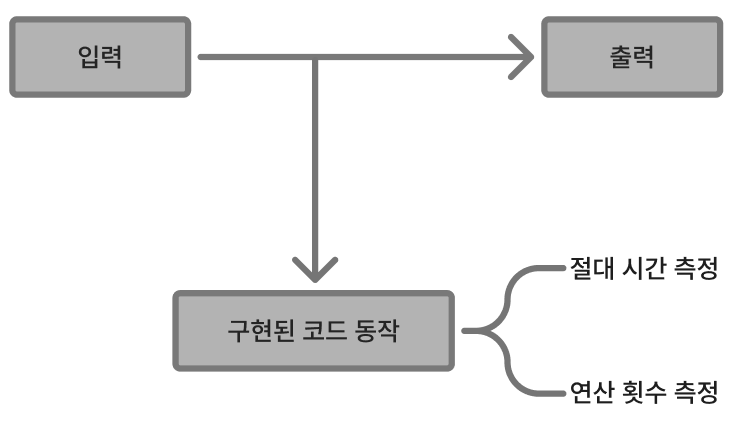
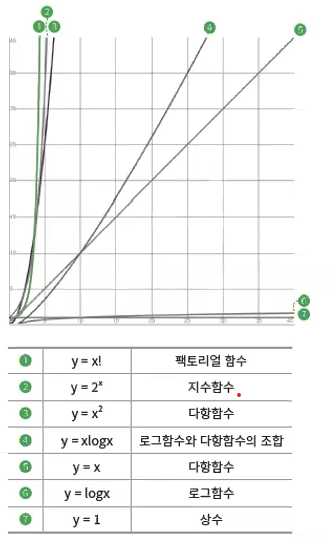

# [학습 노트] 시간 복잡도와 알고리즘 성능 분석

## 1. 알고리즘이란?

"유한한 수의 규칙에 따라 구별 가능한 **기호**들을 조작하여 입력한 정수에서 출력되는 정수를 생성"

### 1-1. 알고리즘의 7가지 필수 성질

- **정밀성(Definiteness)**: 모든 단계를 정확하게 **정의**하며, 수치적으로 **정확한 결과값**이 도출 되어야 한다.
- **유일성(Uniqueness)**: 각 단계가 끝난 후 다음 **수행할 단계**가 무엇인지 명확하게 설계 되어야 한다.
- **타당성 (Effectiveness):** 이론으로만 가능한 것이 아니라, 실제 컴퓨터 **자원 내에서 구현** 가능해야 한다.
- **유한성 (Finiteness):** 알고리즘은 반드시 원하는 값을 도출한 뒤 종료해야 한다. (**무한 루프 방지**)
- **일반성 (Generality):** 특정 데이터 하나에만 작동하는 것이 아니라, 정의된 **범위의 값에서 동작**해야 한다.
- **입력 (Input):** 알고리즘을 수행하는 데 필요한 데이터가 외부에서 입력 가능해야 한다. (0개 이상)
- **출력 (Output):** 알고리즘 수행 후 최소 하나 이상의 결과물(Output)을 도출해야 한다

## 2. 알고리즘 성능 측정법 및 시간 복잡도 개념

### 2-1. 알고리즘 측정법

### 2-2. 절대 시간 측정

실행했을 때 실제 결과값이 도출되는 시간을 측정한 것

- **장점**: 동일한 사양의 컴퓨터일 경우 가장 확실한 성능 지표가 된다.
- **단점**: 각 컴퓨터의 CPU, 메모리 성능 등의 환경에 따라 결과가 달라져 객관성이 떨어진다.

### 2-3. 연산 횟수 측정

코드가 실행되는 기본 명령어의 실행 횟수를 기준으로 측정한다.

- **장점**: 환경 영향을 받지 않아서 객관적인 지표로 사용 가능하다.
- **단점**: 입력값의 크기나 형태에 따라 성능이 결정되므로 기준이 필요하다.
- **해결**: **최악의 경우**를 기준으로 성능을 측정한다.

## 3.시간 복잡도를 빅오 표기법으로 표기하기

### 3-1.점근적 표기법

- 정확한 연산횟수가 아닌, 연산횟수의 추이활용해 시간복잡도를 표기
- 이 때 최악의 경우를 고려해서 점근적 표기법으로 나타내는 것을 빅오표기라고 함

#### 표기하는 방법

1. 다항식에서 가장 많이 영향을 미치는 항을 남기고 제거
2. 마지막 남은 항의 계수를 제거

예)  
3N^2 + 4N + 7  
=> 3N^2  
=> N^2

## 4.코딩 테스트에서 꼭 알아둬야 할 시간 복잡도

## 5.실전 예시
